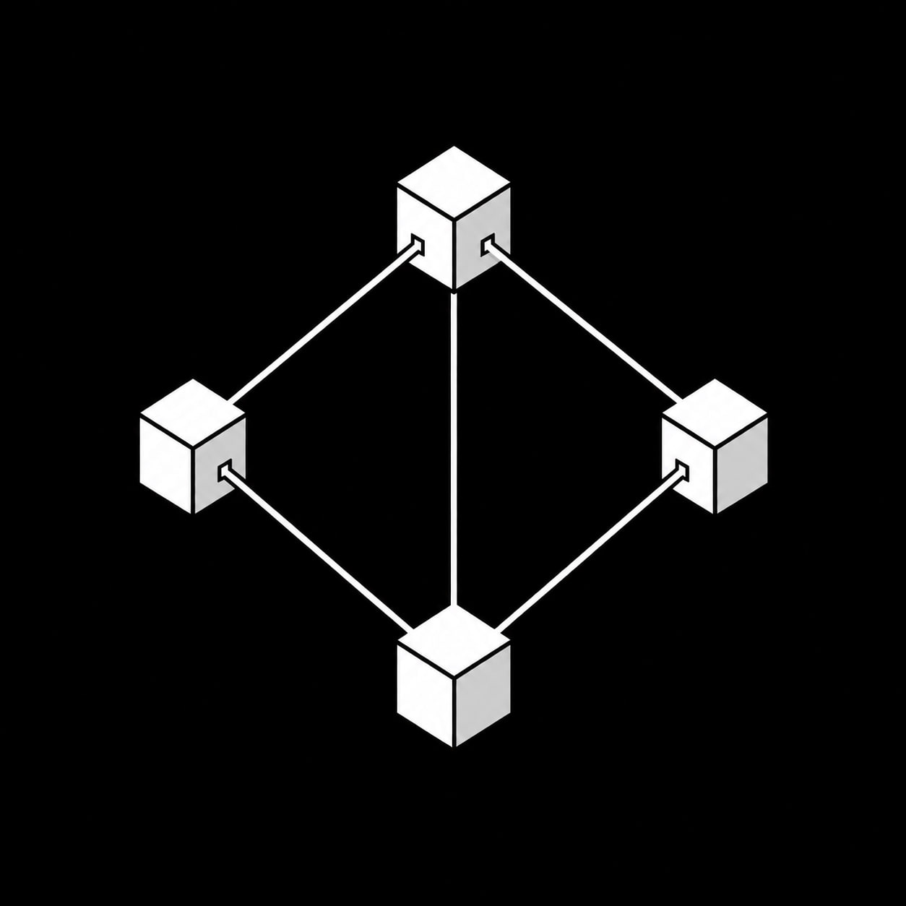

# Grok Block

**Agents act on chain without owning the key.**



A keyless agentic trading framework for Robinhood Chain. You keep the key. Your
agent gets a *mandate* instead — the financial term for authority to act on
someone's behalf within defined limits, which is exactly what this issues: one
asset, a spending cap, an expiry, and a list of approved payees.

The agent signs. The contract decides. It never holds the funds, never holds gas,
and cannot move value anywhere you did not approve.

Live: **https://thegrokblock.com** · **[@thegrokblock](https://x.com/thegrokblock)**

Independent project. Not affiliated with Robinhood Markets, Inc. or xAI.

## Live on mainnet

| | |
| --- | --- |
| Vault | [`0x58B5B1800F52A494a7CEDB5b09ce97AAd41b496A`](https://robinhoodchain.blockscout.com/address/0x58B5B1800F52A494a7CEDB5b09ce97AAd41b496A) |
| Chain | Robinhood Chain mainnet, `4663` |
| Payment | [`0xc32d48e3…`](https://robinhoodchain.blockscout.com/tx/0xc32d48e32d1e416204c921a803b89c967659a22fa62c3b57a3dfb99d487ba04a) — agent signed, relayer paid gas |
| Gasless trade | [`0x5536a4e9…`](https://robinhoodchain.blockscout.com/tx/0x5536a4e9be14a89d4a6e8b762d7494ce11661771a683029e8d65ba42e2c1f2ff) — agent balance unchanged to the wei |

That last one is the whole claim in a single number: the agent's native balance
was `0.000062600286` before the trade and `0.000062600286` after. It signed; the
relayer paid.

## Four parties, and only one holds anything

| | holds | can |
| --- | --- | --- |
| **Owner** | the money | issue mandates, approve payees, withdraw |
| **Vault** | the tokens | enforce the mandate |
| **Agent** | nothing | sign intents |
| **Relayer** | gas | submit transactions, authorise nothing |

Value moves vault → payee in a single hop. The agent is never a stop on that
route, not for one instruction, which is why a compromised agent key cannot drain
anything — only spend what the mandate already allowed, to someone already
approved.

## What it does

- **Pay** — any ERC-20, metered in raw units against a hard cap
- **Trade** — swap through the chain's router, bounded by outcome
- **Subscribe** — recurring charges with an on-chain period counter
- **Gasless** — the agent signs EIP-712 intents; anyone can relay them

## What it deliberately cannot do

- Pay anyone not on the owner's allowlist
- Spend past the cap, or after the mandate expires
- Outlive a revoke — intents already signed die with the mandate
- Hold an allowance: **the vault never calls `approve`**

## Design notes

**No route building.** This chain runs a modified UniversalRouter whose
`V3_SWAP_EXACT_IN` takes six parameters rather than the standard five; omit the
trailing field and it reverts `SliceOutOfBounds()`. Encoding routes in the
contract would break the first time the router moved. So the caller supplies the
calldata and the contract enforces the *outcome*: at most `amountIn` may leave, at
least `minOut` must arrive, both measured from real balances after the call. The
router address is a constant, so caller-supplied calldata reaches exactly one
program.

**Transfers, not approvals.** UniversalRouter never spends an allowance made to
itself — with `payerIsUser = false` it spends its own balance, and with `true` it
pulls through Permit2. So the input is transferred to the router. No allowance is
created anywhere, which means revoking a mandate cannot leave a live capability
behind.

**Metering is asymmetric.** Spending the mandate asset meters the cap; selling
back into it does not, because that returns to the budget rather than spending it.
This is what makes `revise --cap <spent>` a usable soft kill: an agent with zero
headroom can still unwind a position, where a revoke would strand it.

**One asset per mandate.** A cap is one number with no idea what it is counting.
The moment an agent can spend two denominations against one cap, the cap stops
meaning anything.

**Reentrancy.** `spent` increases *before* any external call. The ordering is the
fix; the guard is the backstop.

## Known limit

A token that reports a successful transfer while moving nothing is **not**
detected. The vault meters what it authorised, not what the token did. Checking
balances before and after would catch it and would also break fee-on-transfer
tokens, which move less on purpose. The owner chooses the token, so this is stated
plainly and pinned in a test rather than defended against.

## Using it

```bash
npx -y github:grokblock/rh-intents deploy
```

Or from source:

```bash
git clone https://github.com/grokblock/rh-intents
cd rh-intents && npm i
npm run build && npm test
npm run probe          # re-verifies every address against the live chain
node src/cli.mjs       # commands
```

Three key files, three roles — the split is the security model, and no key is
ever passed as an argument:

```bash
export OWNER_KEY=./keys/owner.key      # holds the money
export AGENT_KEY=./keys/agent.key      # signs only, holds nothing
export RELAYER_KEY=./keys/relayer.key  # pays gas, authorises nothing
```

Everything that spends takes `--plan`, which prints what would happen and sends
nothing. Full walkthrough in [docs/DEPLOY.md](docs/DEPLOY.md), including the three
ways to stop an agent and what to check before trusting a deployed vault.

## Tests

74 against a real in-process EVM at chain id 4663, so EIP-712 domain separators
match what deploys. The router tests use a deliberately hostile stand-in placed at
the real router address — one that takes the input and returns nothing, one that
underdelivers, one that tries to overdraw, one that reverts, one that succeeds
while doing nothing — and the vault refuses every one.

```bash
npm test
npm run probe
npm run probe testnet
```

`probe` exits non-zero if any address in `chain.json` no longer has code, or if a
token's decimals moved. Every factual claim in this file is one of those checks.
